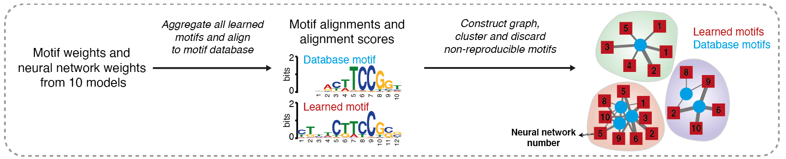
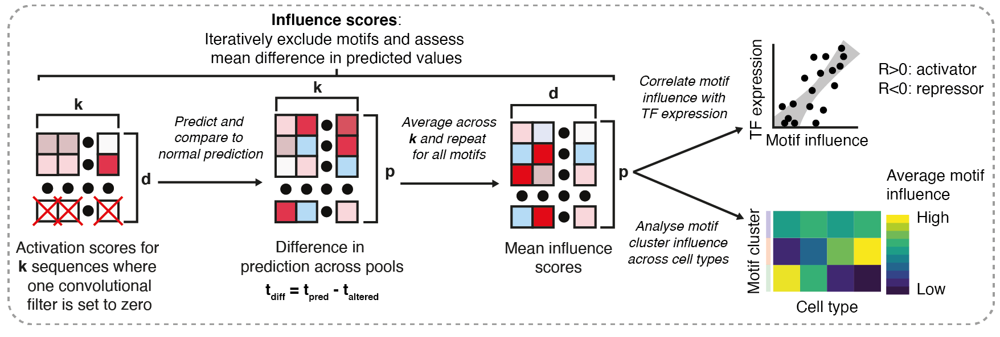

  
```{r setup, include=FALSE}
knitr::opts_chunk$set(echo = TRUE)
```

## Introduction

This vignette focusses on downstream analysis of the output from **scover**. After running
**scover**, it produces several outputs. The most important are:

1. The alignments of the convolutional kernels to a database of motifs, with significance (q-)scores for each alignment
2. The influence scores of the convolutional kernels in the neural network, representing the change in prediction when a particular motif is left out

The central part of **scover** trains *k* (default: 10) different neural network models, each using a 
different 90% of the dataset for training and the remaining 10% for testing. Each model contains *d* (default: 300) convolutional filters, so there are a total of *kd* (default: 3,000) motifs. To ensure that the results are robust, 
**scover** groups similar motif and then identifies motif clusters that show up at least *k/2* models.

The motifs are named as `MODELNUMBER_MOTIFNUMBER`, e.g. motif `2_3` is motif `3` 
from model `2`. The best performing out of 10 models is named "best" rather than 
its model number, e.g. motif `best_129`. 

All of the motifs are aligned with [Tomtom](http://meme-suite.org/meme_5.1.0/doc/tomtom.html), the motif comparison tool from the 
[MEME Suite](http://meme-suite.org/), against a database of known motifs. This generates a tab-separated 
file that shows how the detected motifs aligned to the reference motifs 
and the q-values for the alignments. This result can be represented as a bipartite 
graph where the model motifs and the database motifs represent the two categories of nodes. 
Using this graph we can select reproducible motifs. For a visual overview, see the figure below. 

<center>

</center>

One of the outputs from the model is a HDF5 file containing motif influence scores 
for each model. The scores represent the mean change in prediction for a particular pool when a convolutional filter is left out and they are calculated for each convolutional filter in each pool.

Below is a schematic overview of **scover**'s workflow for motif analysis. The downstream analysis described in this section starts at the third step, 
where we have obtained influence scores from the models and the motif alignments from Tomtom. 

<center>

</center>

## Load packages

I use the following R packages during this guide (see the `sessionInfo()` 
at the end of this guide for an overview of all the loaded packages):
  
```{r load_packages}
suppressMessages(library(rhdf5))
suppressMessages(library(mixtools))
suppressMessages(library(SingleCellExperiment))
suppressMessages(library(dplyr))
suppressMessages(library(magrittr))
suppressMessages(library(reshape2))
suppressMessages(library(igraph))
suppressMessages(library(stringr))
suppressMessages(library(ggplot2))
suppressMessages(library(ggthemes))
suppressMessages(library(gghalves))
suppressMessages(library(ggrepel))
suppressMessages(library(pheatmap))
suppressMessages(library(plotly))
suppressMessages(library(tidytext))

options(stringsAsFactors = F)
```

I've added some custom functions to the following file (find it in the 
`resources` folder of this repository):

```{r set_paths}
source("scover_helper_functions.R")
```

## Set paths

For the rest of the analysis, I am using paths to the network output (`exp_folder`),
the input dataset (`data_path`), and the cell type annotation (`colData_path`). 
I also need to input the motif database that was used for motif alignment (`motif_db_path`).
I will also create an output directory for the analysis. 
In this vignette we will consider the human fetal and adult kidney dataset from 
Stewart et al that was analyzed in our manuscript.

```{r setup_paths}
# Network output dir
exp_folder <- "scover_output/"

# Network input datasets
data_path <- "data/20200825_combined_mature_fetal_kidney_pool120_5u5d.tsv.gz"
colData_path <- "data/20200825_combined_mature_fetal_kidney_pool120_5u5d_colData.tsv"

# Motif alignment db
motif_db_path <- "data/Homo_sapiens.meme"

# Output directory
outdir <- "analysis"
dir.create(outdir)
```

## Read data

First, I will use the custom functions to read the input data, the Tomtom output, and the 
network influence scores. Then I will filter the Tomtom output to only include TFs that 
were expressed.

```{r read_stuff, echo=TRUE, results='hide', fig.keep='all', message = FALSE}
sce <- scover_dataset_to_sce(data_path = data_path, 
                      colData_path = colData_path)

tomtom_table <- read_tomtom_output(motif_db_path = motif_db_path,
                                    exp_folder = exp_folder)

influence_scores <- read_network_hdf5(exp_folder, sce)

# Filter the tomtom table to only include expressed TFs
tomtom_table <- filter_tomtom_table(tomtom_table = tomtom_table, sce = sce)
```

## Graph analysis

Now I will generate a motif alignment graph and plot the graph:
  
```{r plot_graph, echo=TRUE, results='hide', fig.keep='all', message = FALSE}
alignment_graph <- create_alignment_graph(tomtom_table)

# Cluster alignment graph
alignment_graph_clusters <- igraph::cluster_walktrap(alignment_graph)
alignment_graph_cluster_groups <- igraph::groups(alignment_graph_clusters)

# Plot two alignment graphs
plot_alignment_graph(outdir, alignment_graph, alignment_graph_clusters)
```

This is an example output from the last function:

<center>

</center>

To get the motif clusters into a dataframe, I use a custom function (from `scover_helper_functions.R`):
  
```{r get_cluster_df}
cluster_df <- construct_cluster_df(exp_folder = exp_folder, 
                                   alignment_graph_cluster_groups = 
                                     alignment_graph_cluster_groups)
```

I also want to construct a matrix where the motif influence scores are averaged per cell
type:
  
```{r build_avg_influence_scores_matrix}
average_influence_matrix <- construct_average_influence_matrix(influence_scores)
```

I use this function to get information about the motifs in this matrix. This 
will also plot the motif annotation as "good" or "bad": 

(If there are two groups of motifs, one with very very low impact scores and
one with higher impact scores, then the group with very very low impact scores
will be marked as "bad")

```{r get_motif_stats, warning = FALSE}
motif_stats <- get_motif_stats(cluster_df = cluster_df,
                               average_influence_matrix = average_influence_matrix, 
                               pseudocount = 1e-11)
```

The next step will select 'good motifs' based on impact, motif cluster 
reproducibility, and motif cluster annotation (only the clusters that aligned to 
known motifs will be included in this analysis):
  
```{r keep_good_motifs}
# Get names of good motifs: the ones that have high impact, are from 
# reproducible motif clusters, and are aligned to known motifs
motif_stats <- motif_stats[motif_stats$cluster_annot != "NA",]

good_motifs <- rownames(motif_stats)[motif_stats$is_good_motif=="Yes" &
                                       as.numeric(motif_stats$cluster_reprod) >= 0.5]

influence_scores <- influence_scores[good_motifs,]
motif_stats <- motif_stats[good_motifs,]
average_influence_matrix <- average_influence_matrix[good_motifs,]
```

## Plotting the motif influence scores across cell types

If we were to plot the average influence scores of the motifs across the cell types, it 
would look something like this:
  
```{r plot_avg_w_mat, fig.height = 12, fig.width = 12}
# Only use this function if you have 10 or fewer motif clusters at this point.
annotation_colors <- get_annotation_colors(motif_stats)

# Set colors for heatmaps here
heatmap_colors <- colorRampPalette(c("magenta", "black", "yellow"))(100)

# The "drop = FALSE" will make sure the annotation stays a dataframe
pheatmap(average_influence_matrix, 
         annotation_row = motif_stats[,c("cluster_annot"), drop = FALSE], 
         show_rownames = FALSE, angle_col = 45, 
         annotation_colors = annotation_colors, 
         cellwidth = 8, 
         cellheight = .4,
         color = heatmap_colors)
```

Here, each row corresponds to a convolutional filter and each column corresponds to 
a cell type. 

As you can see, a small subset of the motifs (near the bottom) has the largest impact. If we 
instead plot Z-transformed motif influence scores, it looks like this:
  
```{r plot_z_avg_w_mat, fig.height = 12, fig.width = 12}
# Use custom function to get 
average_influence_matrix_z_scores <- to_z(average_influence_matrix)

pheatmap(average_influence_matrix_z_scores, 
         annotation_row=motif_stats[,c("cluster_annot"), drop=FALSE], 
         show_rownames = FALSE, angle_col = 45, 
         annotation_colors = annotation_colors, 
         cellwidth = 8, 
         cellheight = .4, 
         color = heatmap_colors)
```

Already you can see that the motif clusters form more coherent groups. It is important to keep in mind that the relative impacts of motifs in a single cell type cannot be deduced
from this heatmap, as the values have been transformed *per row*. What this does
show is the general 'trend' of the influence scores of a motif across the cell types. 

Z-scores can, however, inflate the differences between cell types. This is why 
it is beneficial to have another score that tells you something about how 
"cell-type-specific" a motif influence score really is. Towards this end, the 
"motif cell type entropy" score has been calculated for each motif. It is defined as the 
normalised Shannon entropy of a motif influence score across cell types. A low motif cell entropy 
score suggests that the influence score distribution is non-uniform. 

Let's plot the motifs along with the entropy scores. I will also order the 
motifs for their motif cluster annotation. This will give us a better overview of how motif clusters vary across cell types.

```{r plot_motif_scores, fig.height = 12, fig.width = 12}

pheatmap(average_influence_matrix_z_scores[order(motif_stats$cluster_annot),], 
         annotation_row=motif_stats[,c("cluster_annot", 
                                       "motif_celltype_entropy")],
         show_rownames = FALSE, angle_col = 45, 
         annotation_colors = annotation_colors, 
         cluster_rows = FALSE, 
         cellwidth = 8, 
         cellheight = .4, 
         color = heatmap_colors)
```


## Better cell type annotation

Many datasets will have a large number of cell types, and it is often beneficial to group the cell types into a 
smaller number of "cell categories". For this, I have created (for this specific example) a named 
vector with the different cell types as names that contains the corresponding cell type category:
  
```{r annotate_celltypes}
Category_table <- readRDS("data/Category_table.RDS")
print(head(Category_table))
```

To add this information to the sce object, you can use this:
  
```{r annotate_sce_cat}
sce$Category <- Category_table[sce$cell_type1]
```


## Refining motif cluster annotations

The current motif cluster annotation is not very specific, but this is a consequence 
of the fact that most motifs can be bound by multiple TFs making it impossible to 
tell which one is binding. Nevertheless, if expression information is available we 
can take advantage of it to identify the most likely candidate. The underlying 
assumption here is that TFs with a higher (absolute) correlation are more likely 
to be involved in the regulation. Please note that this is one of the more bespoke 
steps in this analysis and it is difficult to fully automate. For better control
of the steps in this analysis, I recommend looking at the corresponding
functions in `scover_helper_functions.R`.

The following code will produce plots in the `outdir` that show the expression
pattern for the different cluster candidates, including a Spearman correlation 
score for the different cluster candidate TFs. In addition, it will generate one directory per motif cluster that contain
plots showing how the expression and influence values are related. 
It will also return a DataFrame that contains the relevant information.


```{r plot_cluster_candidates, warning=FALSE, eval=TRUE}
cluster_correlations_df <- plot_candidate_tf_information(cluster_df = cluster_df, 
                              influence_matrix = influence_scores, 
                              motif_stats = motif_stats, 
                              sce = sce, 
                              tomtom_table = tomtom_table)
```

As an example we consider the cluster with YY1, YY2, and THAP1. One of the figures generated by the above function shows the expression levels of the different genes in the family across cell types:

<center>

</center>

YY1 has a higher expression than YY2, making it a more likely regulator than YY2. 
In addition, on the left we can see that YY1 and YY2 have a higher correlation to 
the motif weights (green) and more Tomtom alignments (purple) than THAP1, making 
them the more likely candidates. 

Let's take a closer look at the correlation plots for YY1 and YY2:

<center>
{width=50%} {width=50%}
</center>

Here, the cell type categories are annotated by color. 

We can now update motif cluster annotations using the correlation information. Sometimes it is
hard to identify a single transcription factor, in which case I 
annotate the cluster with the motif family names. Sometimes it can be good to 
look at individual motifs in the motif cluster and look directly at the 
alignments in Tomtom; for this, see the `all_tomtom/tomtom.html` webpage 
generated by Tomtom.  

I do this using the following code (I look at 
`View(cluster_df[cluster_df$cluster_reproducibility >= 0.5,])` to see which 
number corresponds to which cluster):

```{r update_cluster_annotations}
cluster_df$cluster_annot[rownames(cluster_df) == "7"] <- "ETS motif family"
cluster_df$cluster_annot[rownames(cluster_df) == "11"] <- "ZBTB33/BRCA1"
cluster_df$cluster_annot[rownames(cluster_df) == "2"] <- "EGR/KLF motif families"
cluster_df$cluster_annot[rownames(cluster_df) == "9"] <- "YY1"
cluster_df$cluster_annot[rownames(cluster_df) == "3"] <- "bZIP motif family"
cluster_df$cluster_annot[rownames(cluster_df) == "1"] <- "ZFX"

# Update the annotation using the updated "cluster_df"
motif_stats <- get_motif_stats(cluster_df = cluster_df,
                               average_influence_matrix = average_influence_matrix, 
                               pseudocount = 1e-11)
```

```{r plot_z_scores_new_annotation, fig.height = 12, fig.width = 12}
annotation_colors <- get_annotation_colors(motif_stats)
pheatmap(average_influence_matrix_z_scores[order(motif_stats$cluster_annot),], 
         annotation_row=motif_stats[,c("cluster_annot", 
                                       "motif_celltype_entropy")],
         show_rownames = FALSE, angle_col = 45, 
         annotation_colors = annotation_colors, 
         cluster_rows = FALSE, 
         cellwidth = 8, 
         cellheight = .4,
         color = heatmap_colors)
```

## Plotting all motif family correlations

It is helpful to be able to view the correlations for all TFs related to the motif 
families reported by the network. Using the following function, you can plot the 
correlations and expression values for the different motif families, 
while annotating the top top_n hits for each motif family:

```{r plot_motif_families, fig.height = 10, fig.width = 10}
# First I update the motif family names:
cluster_correlations_df$cluster_annot[cluster_correlations_df$cluster == "7"] <- "ETS motif family"
cluster_correlations_df$cluster_annot[cluster_correlations_df$cluster == "11"] <- "ZBTB33/BRCA1"
cluster_correlations_df$cluster_annot[cluster_correlations_df$cluster == "2"] <- "EGR/KLF motif families"
cluster_correlations_df$cluster_annot[cluster_correlations_df$cluster == "9"] <- "YY1"
cluster_correlations_df$cluster_annot[cluster_correlations_df$cluster == "3"] <- "bZIP motif family"
cluster_correlations_df$cluster_annot[cluster_correlations_df$cluster == "1"] <- "ZFX"

plot_motif_family_correlation_overview(cluster_correlations_df, top_n = 5)
```

## Aggregate influence scores for motif families

To get an idea of the influence score of a particular motif family, you can sum 
the influence scores of the motifs belonging to that family. 
Here, I cycle through the motif families and fill an empty matrix with the summed
values of the corresponding motif influence scores:

```{r sum_motif_fam}
# Create empty matrix
aggregate_motif_influences <- matrix(nrow=length(unique(motif_stats$cluster_annot)),
                                     ncol=ncol(influence_scores))
# Cycle through motif families
for(i in 1:nrow(aggregate_motif_influences)){
  current_motif_family <- unique(motif_stats$cluster_annot)[i]
  curr_motifs <- rownames(motif_stats[motif_stats$cluster_annot == current_motif_family,])
  current_motif_influences <- influence_scores[curr_motifs,]
  aggregate_motif_influences[i,] <- colSums(current_motif_influences)
}
# Add column names: pool names
rownames(aggregate_motif_influences) <- unique(motif_stats$cluster_annot)
colnames(aggregate_motif_influences) <- colnames(influence_scores)
```

(With the same method, you can also derive motif family scores averaged per 
cell type category, for example.)

Now that we have these values, we can visualize them with ggplot. First I "melt"
the dataframe, then I add cell type category information, and I use visualisation
tools from the `gghalves` package.

```{r visualize_aggregate_scores, fig.height = 12, fig.width = 12}
aggregate_motif_influences_melt <- melt(aggregate_motif_influences)
colnames(aggregate_motif_influences_melt) <- c("motif_fam",
                                               "pool",
                                               "aggregate_influence")

aggregate_motif_influences_melt$celltype <- str_split_fixed(aggregate_motif_influences_melt$pool, "_", 2)[,1]
aggregate_motif_influences_melt$category <- Category_table[aggregate_motif_influences_melt$celltype]

ggplot(aggregate_motif_influences_melt, aes(x=category, y=aggregate_influence,
                                            fill=category)) +
  geom_half_boxplot() + geom_half_violin(side="r") + # from 'gghalves' package
  theme_Nice() + # from 'scover_helper_functions.R'
  scale_x_reordered() + # from 'tidytext' package 
  scale_fill_stata() + # from 'ggthemes' package
  labs(x="Category", y="Aggregate motif influence") +
  facet_wrap(~motif_fam, scales="free") 
```

## PCA plots based on motif influence scores or expression values

To visualize the expression landscape or the regulatory landscape, it is useful to 
use dimensionality reduction. Here, I will use PCA to plot

1. Motif influence scores across pools
2. Expression values across pools

First, I will do the PCA based on motif influence scores:

```{r w_prcomp}
pca_result <- prcomp(t(influence_scores))

# eigenvalues
eigs <- pca_result$sdev^2
variances_explained <- eigs/sum(sum(eigs))

pca_result <- as.data.frame(pca_result$x)

# See what the coordinates are:
print(pca_result[1:2,1:3])

# Variances explained per PC
print(variances_explained[1:5])
```

I can add cell type and cell type category annotation.

```{r prcomp}
pca_result$Celltype <- colData(sce)[rownames(pca_result),]$cell_type1
pca_result$Category <- Category_table[pca_result$Celltype]
```

In this case, the dataset was made using two different datasets: fetal and 
mature kidney. I will add annotation for the origin of the pools this way (but 
this is specific to this analysis):
  
```{r annot_origin}
pca_result$Origin <- sapply(pca_result$Celltype, FUN=function(x){
  str_split(x, " ")[[1]][1] 
})
```

Now, I will plot the PCA plot, showing the cell type categories as colours, and 
the origin of the pools as the shapes:

```{r plot_pca, fig.height = 10, fig.width = 10}
# Function "scale_color_stata()" is from package ggthemes, 
# and function "geom_label_repel()" is from package ggrepel. 

ggplot(pca_result, aes(x=PC1, y=PC2, color=Category, shape=Origin)) + geom_point() +
  scale_color_stata() + theme_Nice(angled=FALSE) + theme(legend.position = "right") +
  labs(x=paste0("PC1 (", round(variances_explained[1]*100, 2), "%)"),
       y=paste0("PC2 (", round(variances_explained[2]*100, 2), "%)")) +
  coord_fixed() 
```

Now, I will do exactly the same, but based on expression values:
  
```{r exp_prcomp, fig.height = 10, fig.width = 10}
pca_result_expression <- prcomp(t(logcounts(sce)))
eigs_expression <- pca_result_expression$sdev^2
variances_explained_expression <- eigs_expression/sum(sum(eigs_expression))
pca_result_expression <- as.data.frame(pca_result_expression$x)

# See what the coordinates are:
print(pca_result_expression[1:2,1:3])

# Variances explained per PC
print(variances_explained_expression[1:5])

pca_result_expression$Celltype <- sce$cell_type1
pca_result_expression$Category <- sce$Category
pca_result_expression$Origin <- sapply(pca_result_expression$Celltype, 
                                       FUN=function(x){
                                         str_split(x, " ")[[1]][1]
                                       })

ggplot(pca_result_expression, aes(x=PC1, y=PC2, color=Category, shape=Origin)) + geom_point() +
  scale_color_stata() + theme_Nice(angled=FALSE) + theme(legend.position = "right") +
  labs(x=paste0("PC1 (", round(variances_explained_expression[1]*100, 2), "%)"),
       y=paste0("PC2 (", round(variances_explained_expression[2]*100, 2), "%)")) +
  coord_fixed() 
```

## sessionInfo()

```{r session}
sessionInfo()
```
